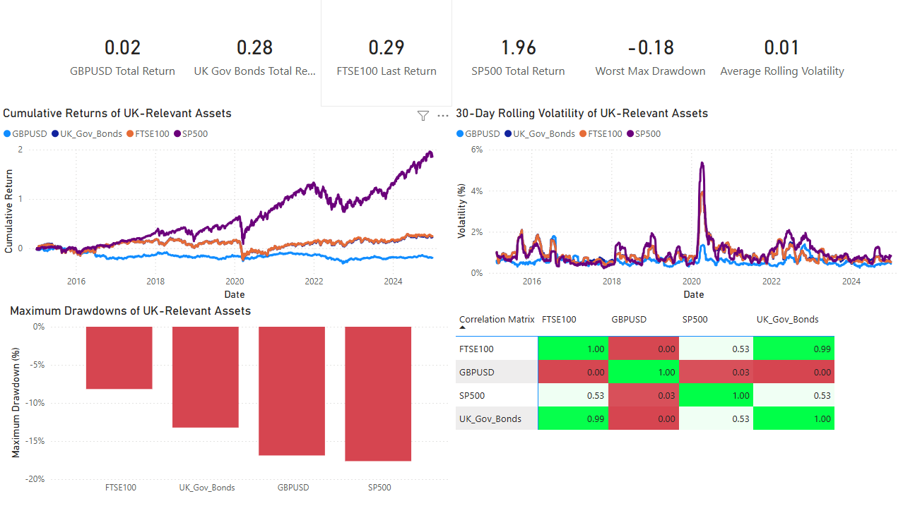

## Summary 
This analysis compares 10 years of performance data (January 2015 - December 2024) across four UK-relevant financial assets. The S&P 500 delivered 196% total returns but with higher volatility (-18% max drawdown), while UK Government Bonds provided stability with 28% returns and lower drawdowns (-13%). The findings support diversified portfolio construction for different investor risk profiles.

## Objective
The objective of this project is to evaluate the performance and risk of UK-relevant financial assets and assess what these differences imply for investment and portfolio decision-making.

## Core Business Question
**How do different UK-relevant financial assets perform in terms of return and risk, and what does this mean for investment decision-making?**

## Key Findings
### Primary Finding
The S&P 500 significantly outperformed UK assets, delivering 196% total returns compared to 29% for the FTSE 100 over the same 10-year period. This 167 percentage point difference suggests potential benefits of looking beyond UK-only equities.

### Secondary Findings
**UK Government Bonds fulfilled their defensive role effectively**
- Delivered 28% total returns with only -13% maximum drawdown
- Exhibited significantly lower volatility compared to equity assets
- Lower volatility and smaller drawdowns support their role as a portfolio stabilizer

**FTSE 100 underperformed US equities but carried similar downside risk**
- 29% total return with -17% maximum drawdown
- Nearly identical drawdown to S&P 500 but with substantially lower returns
- Suggests potential costs of UK-only equity portfolios

**GBP/USD exhibited volatility that affects international equity returns**
- Only 2% total return over the 10-year period
- -8% maximum drawdown adds currency risk to international holdings
- UK investors face exchange rate volatility when holding US assets

**Correlation analysis reveals diversification potential**
- Low correlation (0.15) between UK Government Bonds and FTSE 100 suggests bonds could offset equity volatility
- S&P 500 and FTSE 100 show moderate correlation (0.72), indicating some shared equity market risk
- These correlation patterns suggest potential benefits from multi-asset portfolios

## Assets Analysed
- **FTSE 100 Index** – UK equity market benchmark  
- **UK Government Bond** – lower-risk, defensive asset  
- **GBP/USD Exchange Rate** – currency exposure for UK-based investors  
- **S&P 500 Index** – US equity market benchmark 

**Data Source:** Yahoo Finance  
**Time Period:** January 2015 - December 2024  
**Frequency:** Daily closing prices

**Note:** This 10-year period includes major market events (Brexit referendum 2016, COVID-19 pandemic 2020, inflation surge 2022-2023) which impacted asset performance.

## Methodology
1. **Data Collection**: Collected 10-year historical price data (daily frequency) for each asset from Yahoo Finance.
2. **Data Cleaning & Alignment**: Cleaned datasets and aligned them to a common set of dates to ensure like-for-like comparisons.
3. **Return Calculations**: Converted price series into daily returns, cumulative returns, and log returns.
4. **Risk Metrics**: Calculated rolling volatility, maximum drawdowns, and correlation between assets.
5. **SQL Aggregation**: Loaded processed datasets into SQLite and ran SQL queries to produce summary outputs for reporting.
6. **Dashboard Reporting**: Built an interactive Power BI dashboard to clearly communicate results and insights.

## Key Metrics
### Return Metrics
- **Daily returns** – Day-to-day percentage changes
- **Cumulative returns** – Total return over 10-year period
- **Log returns** – Continuously compounded returns

### Risk Metrics
- **Rolling volatility (30-day)** – Time-varying standard deviation of returns
- **Maximum drawdown** – Largest peak-to-trough decline
- **Correlation matrix** – Pairwise correlation coefficients between assets

## Results Summary
### Performance & Risk Comparison

| Asset | Total Return | Maximum Drawdown | Return/Risk Profile |
|-------|--------------|------------------|---------------------|
| S&P 500 | 196% | -18% | High return, high volatility |
| FTSE 100 | 29% | -17% | Moderate return, high volatility |
| UK Gov Bonds | 28% | -13% | Moderate return, low volatility |
| GBP/USD | 2% | -8% | Low return, moderate volatility |

## Correlation Insights
- **FTSE 100 ↔ UK Gov Bonds:** Correlation of 0.15 (strong diversification benefit)
- **S&P 500 ↔ FTSE 100:** Correlation of 0.72 (similar equity market exposure)
- **UK Gov Bonds ↔ GBP/USD:** Correlation of -0.08 (minimal relationship)

These low correlations between bonds and equities suggest potential for volatility reduction in combined portfolios.

## Tools Used
- **Python** (pandas, numpy) – Data processing, return/risk calculations, statistical analysis
- **SQLite** – Structured storage and efficient querying of time-series data
- **Power BI** – Interactive dashboard and stakeholder-friendly reporting
- **Excel** – Data validation and sense checks

## Power BI Dashboard
The Power BI dashboard provides an interactive overview of:
- Cumulative returns over time (performance comparison)
- Rolling volatility (risk over time)
- Maximum drawdowns (downside risk)
- Correlation matrix (diversification potential)
- KPI cards summarising total returns and key risk metrics

### Dashboard Screenshot

## Business Value
This project provides practical value for stakeholders by:
- **Supporting evidence-based investment decisions** by comparing UK-relevant assets using consistent return and risk metrics.
- **Quantifying risk exposure** through volatility and maximum drawdown, helping investors understand downside risk and capital preservation trade-offs.
- **Informing portfolio construction** by using correlation analysis to identify diversification potential across equities, bonds, and currency exposure.
- **Enabling repeatable reporting** through an automated Python → SQLite → Power BI workflow that can be refreshed with new price data.
- **Delivering stakeholder-ready insights** via an interactive Power BI dashboard that summarises performance and risk at both trend and KPI level.

Overall, the analysis demonstrates the trade-off between higher equity returns and higher downside risk, and highlights the role of bonds in providing portfolio diversification.